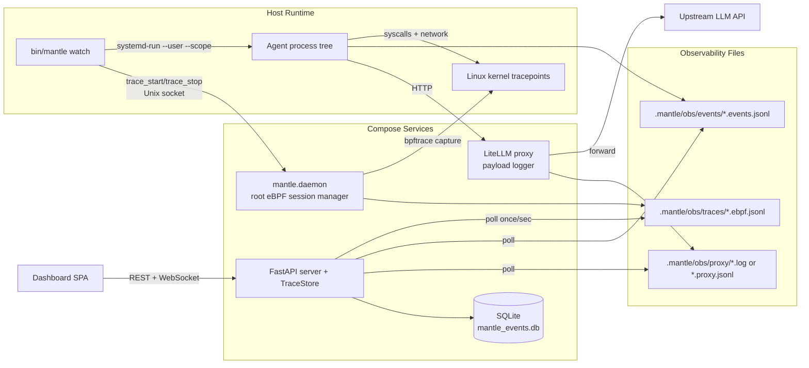
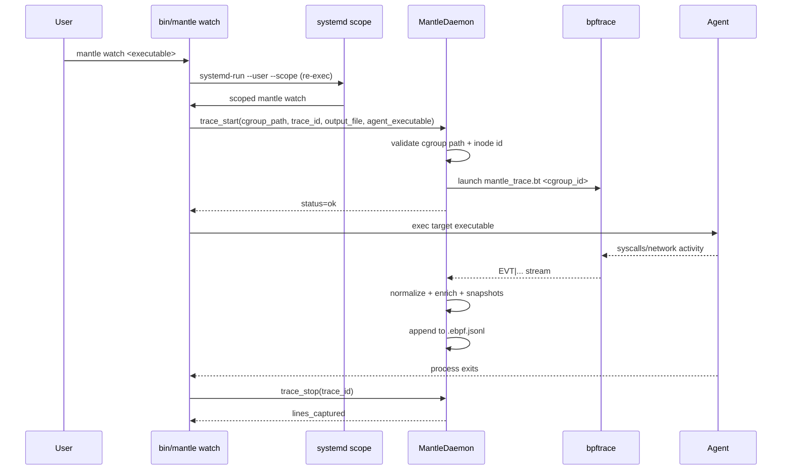
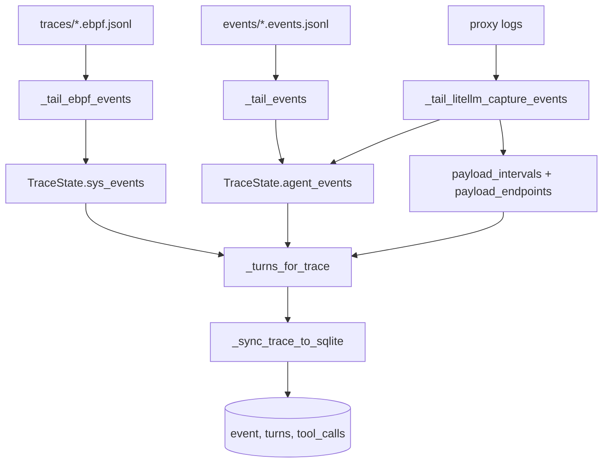
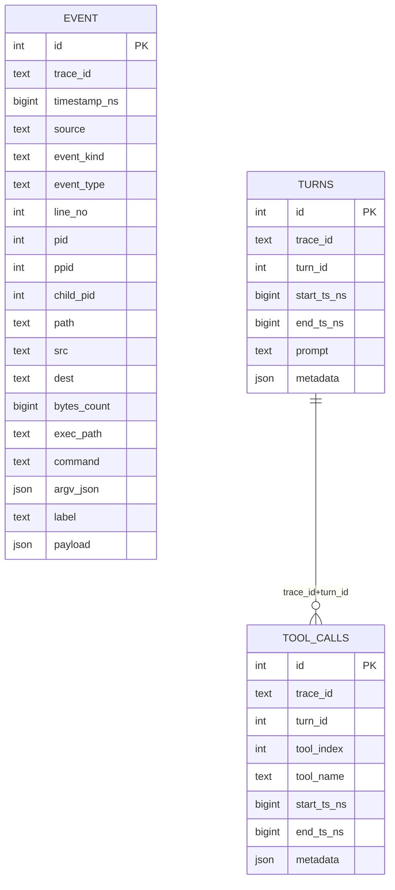

# Mantle Implementation

## 1. Purpose and Audience

This document describes how Mantle is implemented today: runtime topology, capture/correlation pipeline, persistence model, API contracts, and operational limits.

It is written for two audiences:

- Developers: concrete architecture, contracts, and failure semantics needed to extend or debug the system safely.
- Potential clients: what Mantle can observe reliably, where confidence degrades, and what deployment prerequisites exist.

## 2. Scope and Non-Goals

### In scope

- Current capture path: cgroup-scoped eBPF + proxy payload logs.
- Trace ingestion, turn correlation, replay/state-diff generation.
- Dashboard API/UI serving and live update loop.
- Confidence tiers and operational limitations.

### Out of scope

- Future sandbox policy engine
- Full OpenTelemetry ingestion path 

## 3. System Overview

Mantle connects semantic agent behavior (prompts, responses, tool calls) with ground-truth host behavior (process, file, network syscalls) without requiring target-agent code instrumentation.

## 4. Component Responsibilities

| Component | Primary responsibility | Key implementation files |
| --- | --- | --- |
| CLI entrypoint | Service control and watch lifecycle orchestration | `bin/mantle`, `Makefile`, `docker-compose.yml` |
| Daemon | Root-only trace session management and cgroup validation | `mantle/daemon/daemon.py`, `mantle/daemon/client.py`, `mantle/daemon/cgroup.py` |
| eBPF capture | Parse bpftrace EVT stream into normalized JSONL system events | `mantle/capture/mantle_trace.bt`, `mantle/capture/ebpf.py`, `mantle/capture/events_model.py` |
| Agent observability (optional) | Emit native agent event JSONL stream | `mantle_agent/agent_observability.py`, `mantle_agent/cli_agent.py` |
| Proxy payload capture | Record request/response payloads and active-trace mapped logs | `mantle/litellm_proxy/proxy.py` |
| Ingestion and correlation | Tail files, infer turns, tier endpoint confidence, build replay/state views | `mantle/ingest/store.py`, `mantle/analysis/llm_parser.py`, `mantle/analysis/replay.py` |
| Persistence | Canonical event/turn/tool tables | `mantle/ingest/sqlite_store.py`, `mantle/ingest/sql/schema.sql` |
| API layer | Expose trace/replay/summary endpoints and live version channel | `mantle/server/app.py` |
| Frontend | Render traces, replay panes, state diff, process source drilldown | `mantle/server/static/index.html`, `mantle/server/static/app.js` |
| Runtime bootstrap | Runtime path resolution, config scaffold, structured logging | `mantle/runtime/bootstrap.py`, `mantle/runtime/paths.py`, `mantle/runtime/logging.py` |

## 5. Runtime Lifecycle (Watch to Trace)

### Implementation notes

- `mantle watch` uses `_MANTLE_SCOPED` guard to avoid recursive re-entry loops.
- Daemon socket is `/var/run/mantle/mantle.sock`.
- Daemon monitors cgroup liveness and auto-stops sessions when scope directories disappear.
- eBPF requires root daemon privileges and a compatible Linux environment with user-systemd scope support.

## 6. Capture and Ingestion Pipeline

### Polling loop behavior

`TraceStore.poll_once()` executes roughly every second from server startup:

1. Discover new trace files in `*.ebpf.jsonl` and register `TraceState`.
2. Tail eBPF events (strict parsing + normalization).
3. Tail native agent events if present.
4. Tail proxy logs:
   - If native event file exists: interval extraction only.
   - If native event file missing: synthesize agent events from proxy response records.
5. If changed: regenerate this trace payload in SQLite (`replace_trace_payload`) and increment store version.

## 7. Kernel to Userspace Contract

bpftrace emits line protocol records as `EVT|<ns>|<kind>|...` from `mantle/capture/mantle_trace.bt`.

`mantle/capture/ebpf.py` maps these into normalized event objects, then `transform_bpf_record()` validates and canonicalizes shape.

### Canonical system event base fields

| Field | Type | Notes |
| --- | --- | --- |
| `ts` | float | Epoch seconds (converted from monotonic ns with offset) |
| `line_no` | int | Sequence assigned in read order |
| `type` | str | Strictly validated supported type |
| `pid` | int | Process id |
| `label` | str | Human-readable summary |
| `source` | str | Defaults to `bpftrace` when absent |

### Supported normalized event types

| Domain | Types |
| --- | --- |
| Process | `process_spawn`, `command_exec`, `process_exit` |
| File | `file_read`, `file_write`, `file_delete`, `file_rename`, `file_rename_ret`, `file_snapshot`, `fd_open`, `fd_write`, `fd_write_ret`, `fd_close` |
| Network | `net_connect`, `net_send`, `net_recv` |

### Important behavior

- File snapshots are emitted around writes/renames to support replay state diff.
- IPv4/IPv6 `connect` sockaddr extraction is preferred for deterministic endpoint capture.
- Non-EVT stdout lines are passed through and not ingested as system events.

## 8. Turn Correlation and Semantic Layer

Mantle correlates low-level system events with semantic turns/tool-calls using payload logs.

### Turn boundary strategy

- LLM call timestamps are parsed from proxy response records.
- If boundaries exist:
  - optional `setup` span before first boundary when activity exists;
  - then `turn_1`, `turn_2`, ... over boundary windows.
- If no boundaries but activity exists: single `turn_1`.
- If no activity: single `setup`.

### Proxy-derived agent events (when native events absent)

| Event type | Purpose |
| --- | --- |
| `api_call` | LLM request metadata (endpoint/model/duration/status/tools) |
| `system_instruction` | Instructions extracted from request payload |
| `user_prompt_batch` | User prompts extracted from request payload |
| `reasoning_summary` | Response reasoning summary (when available) |
| `assistant_response` | Assistant content |
| `tool_call_started` / `tool_call_finished` | Tool call lifecycle reconstructed from payloads |

### Confidence tier metadata for network mapping

`_with_inferred_net_dest()` enriches network events with destination inference metadata.

| Tier | Label | Meaning |
| --- | --- | --- |
| Tier 1 | `tier1_payload_exact` | Proxy interval exact containment match |
| Tier 2 | `tier2_payload_mapped` | Heuristic mapping (nearest interval/global fallback/precomputed) |
| Tier 3 | `tier3_network_only` | No payload-backed mapping |

## 9. Persistence Model

### SQLite role

SQLite is a derived cache of current in-memory trace state, rewritten per trace update.

- DB path resolves to `<obs_root>/mantle_events.db`.
- `replace_trace_payload()` deletes prior rows for trace and reinserts canonical rows.

### Event row semantics

| Column group | Purpose |
| --- | --- |
| Canonical columns (`pid`, `path`, `dest`, `command`, etc.) | Direct query/filter without JSON decoding |
| `payload` | Residual/unmapped extension fields |
| `event_kind` | Distinguishes `sys` vs `agent` rows |

## 10. API Surface and Frontend Contract

The dashboard UI depends on stable response shapes.

### Primary API groups

| Route group | Purpose |
| --- | --- |
| `/api/traces` | List/delete traces |
| `/api/traces/{id}/replay-turns*` | Replay list/detail payloads |
| `/api/traces/{id}/display-trace` | Unified raw/system timeline view |
| `/api/traces/{id}/process-subtrace/...` | Process-focused drilldown |
| `/api/traces/{id}/replay-state-diff*` | File state diffs between turn windows |
| `/api/traces/{id}/summary` + quality/metrics | Aggregate trace quality and dimension heuristics |
| `/api/settings/llm-schemas` | Runtime schema configuration |
| `/ws` | Version push channel for UI refresh |

### Frontend rendering dependencies

| UI area | Required payload shape |
| --- | --- |
| Replay context pane | `context.sections[]` with values and style metadata |
| Replay action pane | `action.sections[]` plus `tool_call_response_pairs[]` |
| Source PID links | `source.pid` inside tool pair and/or section source metadata |
| State diff view | `summary`, `tree`, `files` and per-file `diff` payload |
| Raw events | `display-trace` summary + grouped timeline entries |

### Live update behavior

- Poll fallback: every 3 seconds in frontend.
- WebSocket optimization: `/ws` emits `{type:"version",version:N}` when store version changes.
- Frontend tolerates WebSocket failure and continues polling.

## 11. Boundary Contracts (Contract Gate)

| Boundary | Producer | Consumer | Contract docs |
| --- | --- | --- | --- |
| Userspace capture <-> kernel event ABI | bpftrace script | eBPF parser | `docs/contracts/kernel-bpftrace-probe-contract.md` |
| Parser output <-> ingest normalization | `ebpf.py` / `events_model.py` | `TraceStore._tail_ebpf_events` | `docs/contracts/ebpf-jsonl-contract.md` |
| Correlation <-> persistence | `TraceStore` | `SQLiteTraceStore` | `docs/contracts/post-processing-correlation-contract.md` |
| Store <-> API | `TraceStore` methods | FastAPI handlers | `docs/contracts/downstream-analysis-contract.md` |
| API <-> frontend | FastAPI JSON responses | `server/static/app.js` renderer | `docs/contracts/frontend-rendering-contract.md` |

## 12. Failure Semantics and Degraded Paths

### Current failure behavior

| Failure point | Behavior |
| --- | --- |
| Invalid eBPF JSON line | Raises runtime error for strict ingest path |
| Unsupported/malformed eBPF type fields | Raises runtime error via strict normalization |
| Native event JSON decode failure | Line skipped |
| Proxy line JSON/object mismatch | Record skipped |
| Multiple unmatched proxy logs | Proxy mapping disabled for that trace, eBPF/native ingest continues |
| Missing trace/turn/pid API lookup | HTTP 404 from FastAPI |

### Operational degradations

| Condition | Effect |
| --- | --- |
| No `systemd-run --user` support | eBPF watch path cannot enter cgroup scope |
| Daemon not reachable on Unix socket | watch fails trace start |
| Proxy not active or no matching proxy file | semantic turn enrichment may degrade; network quality falls toward tier3 |
| No native events and no proxy payload | replay remains system-event only |

## 13. Security and Trust Boundaries

| Area | Current posture | Practical implication |
| --- | --- | --- |
| Daemon privilege | Root-required service managing bpftrace sessions | Host-level capture power; deploy with controlled access |
| Daemon socket permissions | Socket created mode `0666` | Acceptable for single-user dev flow, risky on shared hosts |
| Capture scope | cgroup inode filtering | Limits traced events to watched process tree |
| Proxy auth forwarding | Header allowlist + optional server-side API key override | Reduces accidental upstream header leakage |
| Data at rest | Local JSONL + SQLite files under `.mantle` | Operator controls retention and cleanup policy |

## 14. Testing and Verification Matrix

| Test level | Coverage in repository | Typical confidence |
| --- | --- | --- |
| Unit | Parsing, normalization, replay helpers, syscall utilities | Contract-level correctness for core transforms |
| Integration | TraceStore polling/correlation + dashboard API behavior | Cross-module behavior and schema integrity |
| E2E | Full trace pipeline (real API key path) + dashboard UI smoke | Runtime confidence including serving/rendering flow |

### Notable test targets

- `tests/unit/test_ebpf_event_parsing.py`
- `tests/unit/test_events_model.py`
- `tests/unit/test_llm_utils.py`
- `tests/unit/test_replay_trace.py`
- `tests/integration/test_trace_store.py`
- `tests/integration/test_dashboard_api.py`
- `tests/e2e/test_full_trace_pipeline.py`
- `tests/e2e/test_dashboard_ui.py`

## 15. Current Gaps and Explicit Limitations

- OTEL ingestion path is not implemented (`mantle/ingest/otel.py` is currently empty).
- Agent OTEL contract doc is currently empty (`docs/contracts/agent-otel-ingestion-contract.md`).
- MITM module exists in codebase, but active ingestion/runtime path is proxy-based.
- Some decode errors in optional input streams are skipped rather than hard-failed; strict no-silent-failure behavior is strongest on eBPF ingest path.

## 16. Change Protocol for Architecture-Safe Work

When changing architecture-affecting behavior:

1. Update relevant contract files under `docs/contracts/` for any boundary shape changes.
2. Update producer and consumer in the same change (no staged compatibility drift).
3. Update integration/e2e tests covering the changed boundary.
4. Record decision context in `docs/micro-decisions.md`.
5. Verify dashboard replay and source drilldown flows still render correctly.

## 17. Acceptance Checklist

- [x] Dual-audience system design narrative (developers + clients)
- [x] Runtime topology and watch lifecycle
- [x] Capture -> ingest -> correlation -> persistence flow
- [x] API/UI contract surface summary
- [x] Confidence tiers and limitations
- [x] Failure semantics and degraded modes
- [x] Verification map to existing tests

---

This document reflects the implementation currently present in the Mantle repository and is intended to be maintained alongside code and contract updates.
